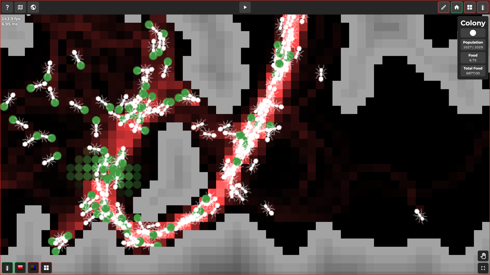

# Ants Simulation

Ants Simulation made using HTML, CSS, TypeScript and Tailwind CSS.

## Inspiration

Project was mainly inspired by [Pezzza's Work](https://www.youtube.com/watch?v=81GQNPJip2Y&list=PLPiMlUuvmixC-R-5DXE6k2P6FdKn71JGY) and [Sebastian Lague](https://www.youtube.com/watch?v=X-iSQQgOd1A)

# Demo

Live demo: https://thugraven.github.io/Ants_Simulation/

